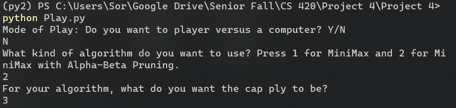
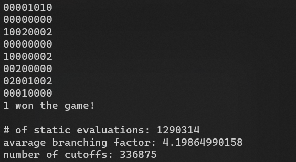

Automated Konane Playing Program
***************************************************************************
***************************************************************************
This programs lets users play Konane, a Brazilian
checkers game, either completely automated (computer
plays against itself) or half automated (player
plays against computer).
***************************************************************************
Rules of the game can be found [here](https://en.wikipedia.org/wiki/Konane)
***************************************************************************
To start, the program, go to the directory this readme
file is located in, and in the command prompt type in
> python Play.py

***************************************************************************
Note that the program only runs with Python 2. Later
versions of Python would result in syntax errors.
***************************************************************************
After that, the program will prompt the user to input
the mode of play - type
> 'Y' if you want to play versus the computer and \
> 'N' if you want the computer to play against itself

***************************************************************************
Then it will ask the user for another prompt. Type in
> '1' if you want to use the regular minimax algorithm \
> '2' if you want to use minimax with alpha-beta pruning

***************************************************************************
Finally, the player should choose the maximum number of ply the
minimax algorithm should be run over:
>suggested values are 1,2, and 3. Note that 1 ply = 2 rounds (black plays then white plays)

***************************************************************************
If the player chose to play against the computer, a he/she must
choose a side. Type in
> '1' if the player wants to play black (starts first) \
> '2' if the player wants to play white

***************************************************************************
The first turn is a removal, so player should type in
> "X Y"

where (x,y) is the coordinate of the piece intended to be removed.
X runs from 1 to 8 top to bottom and Y runs from 1 to 8 left to right
***************************************************************************
Any subsequent turn played by the player must be typed in in the
following format:
> "X Y DIRECTION NO_OF_JUMPS"

where

> X refers to the x-coordinate of the starting piece \
> Y refers to the y-coordinate of the starting piece \
> DIRECTION can be 'U' for up, 'D' for down, 'L' for left, 'R' for right \
> \NO_OF_JUMPS can be 1,2, or 3. Jumps have to be in the same direction.

***************************************************************************
Invalid entries might result in errors and termination of the
program.
***************************************************************************
After the game finishes, the program will print out the following
statistics:
> 1. Number of times a static evaluation was done \
> 2. Average branching factor \
> 3. Number of cutoffs that took place

Hope you enjoy the game!
***************************************************************************
***************************************************************************
